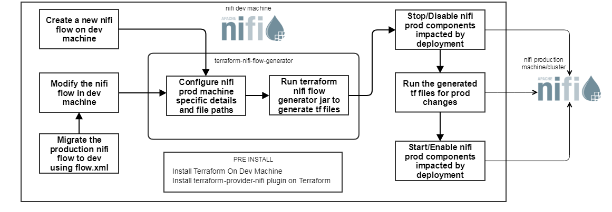

[](https://travis-ci.org/Nordstrom/nifi_terraform_generator)
[](https://codecov.io/gh/Nordstrom/nifi_terraform_generator)

## What
- A component which takes nifi flow xml file as input and converts it into terraform script for creating/updating a flow on nifi
- A component which dynamically generates curl commands to stop and start process groups, processors etc
- A component which can monitor count of records in the connector linked between processors   

## Prerequisites
* Java 1.8
* Maven 3+

## Reference

The generated terraform works using the `terraform-provider-nifi` plugin which can be built from: 

https://github.com/Glympse/terraform-provider-nifi/

## Features
* Dynamic generation of terraform script(`.tf`) from flow.xml for creating nifi flows. Each processor group will have a corresponding terraform file which makes it easily manageable(vs one monolithic tf file)
* Leverage terraform capability to identify delta and apply those changes alone
* Single variables.tf file to support remote nifi flows and multiple process groups
* Experimental: Remote Process Groups creation using terraform. This is also not currently supported by terraform-provider-nifi plugin.
* A functionality to generate curl commands for interacting directly with nifi through nifi-api. The commands generated primarily to stop/start processors, controller services, ports, process groups etc which are required before doing any modification on nifi slow   
* A functionality to monitor the ongoing processes in nifi flow, which are expected to be drained before doing any modification on nifi flow. Basically a helper for doing nifi flow modification 

## Project setup
* Select a machine which has access to the nifi cluster through web api calls (no firewall restriction)
* The machine should have java 1.8 and maven 3+ installed
* Download the source code and run the command ```mvn clean install``` from the root folder of the project (the folder at which pom.xml file is present)
* An executable jar file - nfi_terraform_generator-1.1-jar-with-dependencies.jar will get generated in the target folder of the project
* Configuration parameters to the project can be supplied through a properties file say config.properties. The details of the configuration parameters in the properties file and a sample entry is explained in the respective sections

## How to generate terraform scripts of a nifi flow
### Terraform file generator config
* terraform - a flag to control the generation of terraform files. T for enabling and F disabling terraform generation
* nifi_machine - the hostname and port configuration of the nifi cluster. A sample entry - 172.16.71.119:9090
* root_element - the id of the root element of Nifi cluster on which the terraform file should create the nifi flow. This can be located on the configuration flow.xml that present in the nifi cluster in the xpath rootGroup > id. A sample entry - f17a831b-0165-1000-0db2-ee60c718dec2
* source_xml_path - the path of the nifi configuration flow.xml which should be supplied as an input for terraform  generation. This file can be extracted from nifi cluster root machine present in the location `{Nifi HOME}/conf`. A sample entry - D:\\workspace\\flow.xml
* destination_folder_path - the path at which the generated files will be present. A sample entry - D:\\workspace\\generated

### Execution Steps
- Step 1 : From an existing nifi cluster, extract the flow.xml.gz from master node located in the folder - `{Nifi HOME}/conf`.
- Step 2 : Copy the extracted flow.xml to a folder on your machine on which you will be running the project.
- Step 3 : Create a configuration file and make the configuration entries mentioned under the section **'Terraform file generator config'**
- Step 4 : Using the executable jar(refer **'Project setup'**), generate terraform scripts using the command ```java -jar nifi_terraform_generator-1.1-jar-with-dependencies.jar <path to the configuration file>```  
The terraform files will get in the configured destination folder

## How to use terraform scripts to setup a flow on NIFI cluster?

### Create a brand new flow
* In the development nifi cluster, create the nifi flow which needs to be migrated to production. 
* Generate tf files as explained in the section - **'How to generate terraform scripts of a nifi flow'** using the `flow.xml` file in development nifi cluster.
* Install terraform and terraform-nifi-provider plugin on a machine which has access to production nifi cluster(A machine in production nifi cluster can also be used). 
* Copy all the terraform files to the terraform machine 
* Run the following commands to create a cluster in NIFI```
sudo ./terraform init
sudo ./terraform plan -out=plan.out
sudo ./terraform apply plan.out```This will create the entire flow in NIFI.
* Generate curl commands as explained in the section - **'How to generate curl commands'**
* To start all process groups execute the shell script - curl_start.sh. 

### Update/Modify an existing flow
* Assuming that the development nifi cluster has the same flow configuration as that in production, we could make the new changes in development cluster. To be on a safer side we could even migrate the production flow to development environment before making any changes.     
* Identify the name of the processors and process groups on which the change was done 
* Generate tf files as explained in the section - **'How to generate terraform scripts of a nifi flow'** using the `flow.xml` file in development nifi cluster.
* Install terraform and terraform-nifi-provider plugin on a machine which has access to production nifi cluster(A machine in production nifi cluster can also be used).
* Copy all the terraform files the terraform machine 
* Populate the configuration file with the impacted process groups and processors. Also identify the source processors which should be stopped to make sure that there are no processes ongoing when the flow change is being done. 
* Generate curl commands as explained in the section - **'How to generate curl commands'**
* Run the shell script curl_stop_processors.sh to stop all the source processors
* Do monitoring of the ongoing processes as explained in the section - **'How to do monitoring'** 
* Once all the messages are processed or reached to the destination, stop the process groups using the shell script curl_stop.sh  
* After stopping the process groups the following commands can be used to deploy an update:
```
sudo ./terraform init
sudo ./terraform plan -out=plan.out
sudo ./terraform apply plan.out
```
* Terraform will identify the previous state and will apply the delta/change of the flow to the existing flow.
* Post this we can start the process group(which will start the processors also) using the shell script curl_start.sh  

## How to generate curl commands
### Curl commands generator config for stopping/starting components
* generate - a flag to control the generation of curl commands files. T for enabling and F disabling curl commands generation
* processors_to_stop - the comma separated processor names on which need to be stopped before making a nifi flow change. A sample entry - PCR_39S7VK_ConsumeKafka,PCR_39S7VK_GenerateFlowFile. curl commands to stop processors will be generated on the file destination_folder_path/curl_stop_processors.sh
* deploy_process_groups - the comma separated process group names impacted by the nifi flow modification. All the processors, controller services, ports, process groups etc needs to be disabled/stopped before doing any modification. The stop and start curl commands of these components will be generated on files curl_stop.sh and curl_start.sh respectively at destination_folder_path. A sample entry - PGP_B65B7Q_Read_Kafka_And_Write2Folder,PGP_H76388_GenerateFile_And_Write2Kafka

### Execution Steps
On executing the terraform scripts(explained in the section - **'How to use terraform scripts to setup a flow on NIFI cluster'**), all components will get created, however the process groups has to be started explicitly. Also for making any modification on a processor/process group we might have to stop all the source processors and wait till the ongoing messages get processed. Post this we might have to stop or disable the impacted processors, controller services, ports or even the process groups itself before making any modification. We can achieve this by sending curl commands to Nifi Api. The steps to generate these curl commands are given below.
- Step 1 : Identify the name of the processors and process groups which needs to modified.
- Step 2 : Create a configuration file and make the configuration entries mentioned under the section **'Curl commands generator config for stopping/starting components'**
- Step 3 : Using the executable jar(refer **'Project setup'**), generate curl commands using the command ```java -jar nifi_terraform_generator-1.1-jar-with-dependencies.jar <path to the configuration file>``` 

The curl commands to stop processors, start and stop process groups and other components will get generated on the destination    

PS :- Since these commands are getting generated dynamically through nifi api calls, it is mandatory to have the connectivity from the source machine to nifi cluster. Also make sure you generate curl commands after each change you make on the nifi flow, to get the latest version number updated in curl commands.           

## How to do monitoring
Monitoring is limited to displaying the count of messages in process. This is to aid any change in nifi flow. To avoid data loss we should make sure that there is no ongoing messages before making any change on nifi flow.
### Curl commands generator config for monitoring
* monitor - a flag to control the monitoring of messages. T for enabling and F disabling monitoring
* monitor_process_groups - the comma separated process group names which needs to be monitored. The count of messages present on the connectors between processors will be shown in monitoring. To avoid data loss we should wait till all the messages in the connectors get processed, before doing any modification in the flow. A sample entry - PGP_B65B7Q_Read_Kafka_And_Write2Folder,PGP_H76388_GenerateFile_And_Write2Kafka

### Execution Steps    
- Step 1 : Identify the name of the process groups which needs to monitored.
- Step 2 : Create a configuration file and make the configuration entries mentioned under the section **'Curl commands generator config for monitoring'**
- Step 3 : Using the executable jar(refer **'Project setup'**), generate curl commands using the command ```java -jar nifi_terraform_generator-1.1-jar-with-dependencies.jar <path to the configuration file>```

The count of ongoing messages in the connector between processors will be displayed in console

PS :- Since these commands are getting executed through nifi api calls, it is mandatory to have the connectivity from the source machine to nifi cluster.

The same executable jar file and the same configuration file can be used for all the 3 actions, even though mentioned separately.  


### Components/Actors of terraform nifi deployment 


