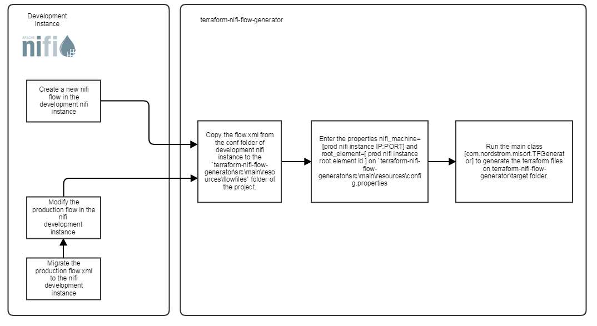
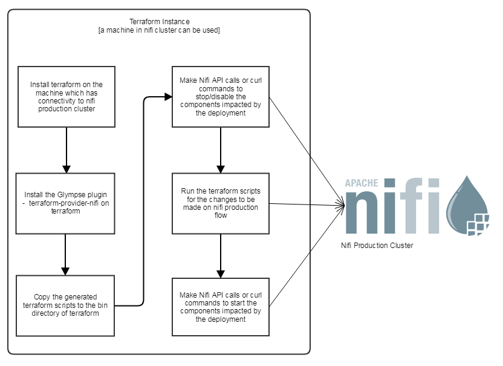

[](https://travis-ci.org/Nordstrom/nifi_terraform_generator)
[](https://codecov.io/gh/Nordstrom/nifi_terraform_generator)

## What
A component which takes nifi flow xml file as input and converts it into terraform script for creating/updating a flow on nifi

## Prerequisites
* Java 1.8
* Maven 3+

## Reference

The generated terraform works using the `terraform-provider-nifi` plugin which can be built from: 

https://github.com/Glympse/terraform-provider-nifi/

## Features
* Dynamic generation of terraform script(`.tf`) from flow.xml for creating nifi flows. Each processor group will have a corresponding tf file which makes it easily manageable(vs one monolithic tf file)
* Leverage terraform capability to identify delta and apply those changes alone
* Single variables.tf file to support remote nifi flows and multiple process groups
* Experimental: Remote Process Groups creation using terraform. This is not supported by the plugin itself.

## Usage
* From an existing nifi cluster, extract the flow.xml.gz from master node located in the folder - `{Nifi HOME}/conf`.
* Copy the extracted flow.xml to a folder on your machine on which you will be running the project.  
* Create a destination folder on your machine on which you want the generated terraform files.
* Download the nifi_terraform_generator source code and navigate to the root folder of the project (folder on which pom.xml is present)
* Run the command ```mvn clean compile exec:java -Dexec.args="<nifi_machine> <root_element> <source folder> <destination folder>"```
  - nifi_machine       : the hostname and port combination of nifi , say localhost:8080.
  - root_element       : the id of the root element of Nifi cluster on which the terraform file should create the nifi flow. This can be located on the flow.xml that we fetched from the cluster in the above step. A sample entry - <rootGroup> <id>34900dd5-0161-1000-b7a0-ed93f5fa490d</id>.
  - source folder      : path on which the flow.xml is present on the running machine .
  - destination folder : folder on which terraform files needs to be generated.
* terraform files will be generated at the destination folder. 

## How to use terraform scripts to setup a flow on NIFI cluster?

### Create a brand new flow
* Generate tf files as mentioned above using the `flow.xml` file in nifi cluster.
* Install terraform and terraform-nifi-provider plugin on a machine which has access to nifi cluster(A machine in nifi cluster can also be used). 
* Copy all the terraform files to the terraform machine 
* Run the following commands to create a cluster in NIFI```
sudo ./terraform init
sudo ./terraform plan -out=plan.out
sudo ./terraform apply plan.out```
* This will create the entire flow in NIFI. To start each process group REST calls can be used. 

### Update/Modify an existing flow

* Generate tf files as mentioned above using the `flow.xml` file in nifi cluster.
* Install terraform and terraform-nifi-provider plugin on a machine which has access to nifi cluster(A machine in nifi cluster can also be used). 
* Copy all the terraform files the terraform machine 
* It is recommended to use REST calls to NIFI cluster to stop the sources of existing flow. Post this we should let all the messages to complete execution before deploying a modification or update to existing flow. This can be best demonstrated with an example. Imagine the following flow:
```A(source)->B(some transformation)->C(destination)```
In this flow `A` needs to be stopped and we need to let all messages to make to the destination `C`. If this step is omitted, the messages in flight can be lost which is not desirable in some scenarios. 
As expected by nifi architecture we start/stop each processor, ports, and controller services before making any deployment. 
* Once all the messages are drained or reached to the destination, the following commands can be used to deploy an update:
```
sudo ./terraform init
sudo ./terraform plan -out=plan.out
sudo ./terraform apply plan.out
```
* Terraform will identify the previous state and will apply the delta/change of the flow to the existing flow. 

### Terraform Script Generation



### Nifi Production deployment using terraform


